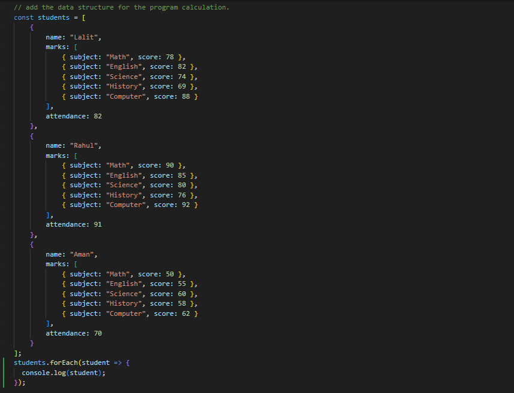

## Screenshots

---

### 1. Students Data Structure

This screenshot shows the structured data of students used in the program. It includes student names, subject-wise marks, and attendance, which are used for all further calculations.

